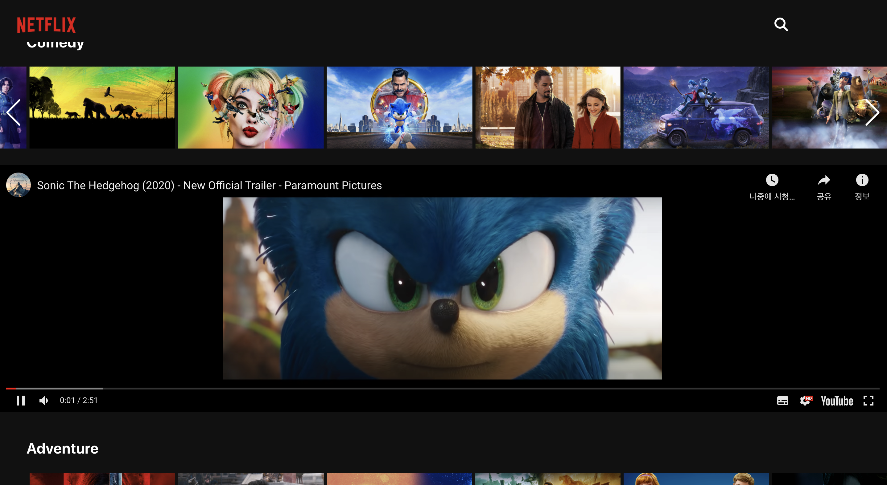
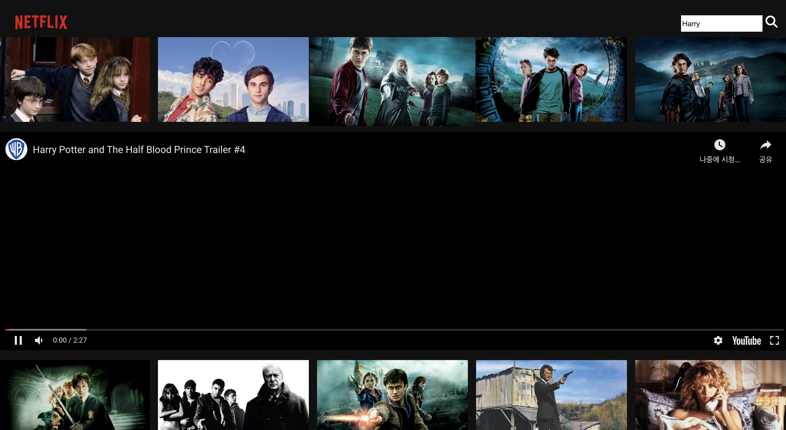

## Netflix Clone Project

[Netflix Clone](https://danieljang99.github.io/Netflix_Clone)

A Single-Page Web Applicaiton cloning Netflix, built with React JS, Redux, SCSS, and TMDB API.

React framework으로 넷플릭스을 클론한 SPA 프로젝트 입니다.

### `Project Status`

This project is currently in development. Users can search for movies and watch the trailers availabe on Youtube by clicking their posters. Functionality to store movies selected by the user ("My List") and improvement in UI are in progress.

이 프로젝트는 아직 진행 중입니다. 현재로선 유저는 영화를 검색할 수 있고 선택한 영화의 예고편을 유튜브를 통해 볼 수 있습니다. 유저가 고른 영화를 DB에 저장하거나 ("내가 찜한 콘텐츠") 전반적인 UI 개선을 목표로 현재 개발하고 있습니다.

### `Project Screen Shots`

Screen Shot of the homepage 1

Screen Shot of the homepage 2

Screen Shot of the moviepage

Screen Shot of the Search page

### `References`

https://www.youtube.com/watch?v=XtMThy8QKqU

This tutorial was used as a reference for Netflix styling and using the TMDB database.

넷플릭스 스타일링과 TBDB 활용 방법은 이 튜토리얼을 참고했습니다.
